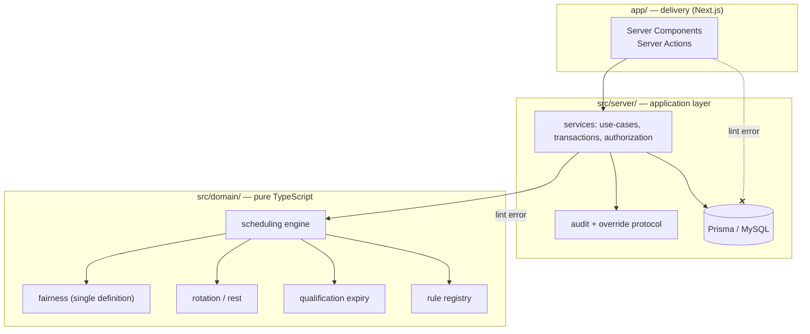
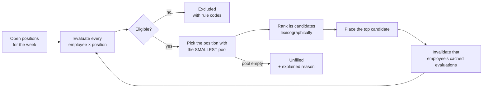

# ATALEF — Workforce Scheduling for an Offshore Security Unit

> **Portfolio showcase.** This repository presents the design and a few selected pieces of a
> production system I built. It is not the full source code, it is not runnable, and it is not
> licensed for reuse. See [NOTICE.md](NOTICE.md).

ATALEF replaced a manual, message-driven rostering process with a web system that is now in
daily use: around a hundred employees working rotations on offshore sites and a vessel. It
started as my B.Sc. final project in Industrial Engineering & Management.

**Stack:** Next.js 15 (App Router) · TypeScript (strict) · Prisma 6 · MySQL 8 · Zod ·
Tailwind CSS · Argon2id sessions · Vitest + Playwright · PM2 / Nginx · Hebrew RTL

---

## The problem

Every week, staff sent their availability through a messaging app. One manager collected it
into a spreadsheet and built the roster by hand.

The difficulty was never volume. It was how many things had to be weighed at once:

- each person's **role**, and whether they may stand in for another role;
- which **certifications** they hold, and whether those are still valid;
- **approved and pending leave**;
- **rotation rules**: two weeks on, then two or four weeks off, depending on the contract;
- **fairness**: who has been carrying more than their share this quarter.

Each of these depends on the others, so one late change could topple the whole week.

## What the system does

Ten modules cover the whole lifecycle:

| Module | Responsibility |
|---|---|
| Identity | Accounts, activation, sessions, password lifecycle |
| Employees | Roster, lifecycle (active / inactive / archived), self-service profile |
| Assets | Operational sites and their structured position composition |
| Staffing | The required headcount per site: a base requirement plus time-bound overrides |
| Constraints | Leave and availability requests with a review state machine |
| Training | Training types, events, attendance, qualifications and expiry |
| Scheduling | Weeks, two-week rotation blocks, the automatic engine, publication |
| Planning | A "what-if" simulator that never touches operational data |
| Reporting | Reports and dashboards for managers and employees |
| Platform | Rule registry, override protocol, audit trail, settings, files |

Managers work on desktop; employees work on their phones. The interface is Hebrew-first,
right-to-left.

## How I thought about it

### 1. The algorithm recommends, the manager decides

The engine produces a **draft**. Nothing is ever published automatically. When a manager
overrides an operational rule, the system doesn't quietly allow it: it asks for a reason and
records who did it, when, and exactly which warning they saw.

### 2. One rule, one implementation

The legacy system had two scheduling engines, two training systems and three different
fairness calculations, and they disagreed with each other. In ATALEF every business rule lives
in exactly one pure function. The automatic engine, the manual picker, swaps, reports and the
simulator all call the same code, so they cannot drift apart.

### 3. A domain layer the framework cannot reach



`src/domain/` may not import Prisma, Next.js, React or anything from the server layer. This is
enforced by ESLint, not by convention ([excerpt](excerpts/eslint.layering.mjs)). As a result,
the scheduling logic is deterministic and unit-testable with plain fixtures, and the same
numbers appear in scheduling, reports and the simulator.

### 4. Scheduling is an optimization problem wearing a form

Writing a system that *blocks* an invalid assignment is easy. Producing a *fair* roster that
real people will accept is the hard part. The engine works like this:



- **Scarcity first.** The engine fills the hardest position next, based on *live* pool sizes
  recomputed after every placement, not on a fixed role order.
- **Explainable.** Every position records why its candidate was chosen, who ranked lower, and
  who was excluded by which rule. An unfilled position explains itself too, for example
  "3 qualified, all excluded: rest violation (2), approved leave (1)".
- **Rotation-aware.** The second week of a two-week block copies the first week's placements
  whenever the person is still eligible, and warns if a block gets split.
- **Fairness self-corrects within a run.** Someone placed in week 1 automatically drops in
  priority for week 3.

Code: [`engine.ts`](excerpts/domain/scheduling/engine.ts) ·
[`evaluate.ts`](excerpts/domain/scheduling/evaluate.ts) ·
[`rank.ts`](excerpts/domain/scheduling/rank.ts)

### 5. Fairness has exactly one definition

Raw assignment counts are never compared across people on different contracts. Each person has
an *expected* number of weeks in the period, based on their work pattern, and the engine
compares them by how far they are from it:

```
expectedWeeks  = |period| × (1/2 for 2-on-2-off, 1/3 for 2-on-4-off)   // fractional, never rounded
periodBalance  = assignedWeeks − expectedWeeks                          // < 0 means "owed work"
normalizedLoad = assignedWeeks / expectedWeeks                          // comparable across patterns
```

History (the previous quarter) only breaks ties, so it informs the ranking without dominating
it. → [`fairness.ts`](excerpts/domain/fairness/fairness.ts) ·
[decision](docs/decisions/002-single-fairness-definition.md)

### 6. Ranking strategies are permutations, not weights

Managers can choose a strategy, such as *fairness first* or *continuity first*. I deliberately
did **not** build a weighted score. The factors can't be measured on one scale (an ordinal
tier, a boolean, a number of weeks, a date), so any weights would be guesswork, and
"score 0.734 vs 0.729" is not a reason a manager can act on. A strategy is simply a different
order of the same six comparisons.
→ [decision](docs/decisions/004-ranking-permutations-not-weights.md) ·
[`strategy.ts`](excerpts/domain/scheduling/strategy.ts)

### 7. "Never silently violate" is structural

Every rule is classified once, in a [single registry](excerpts/domain/rules/registry.ts):

| Class | Meaning | Examples |
|---|---|---|
| **INTEGRITY** | Never bypassed by anyone | role mismatch, slot occupied, employee not active |
| **OPERATIONAL** | Blocks unless a manager overrides it with a reason | rest violation, approved leave, editing a published week |
| **WARNING** | Informational, never blocks | qualification expiring, pending leave |

Every mutating service runs the [same override protocol](excerpts/server/override.ts). No code
path goes from a warning to the database without recorded consent. Rules are re-evaluated when
the form is resubmitted, and a rule that appears only at that point triggers a new prompt.
→ [decision](docs/decisions/003-override-protocol.md)

### 8. Drafts are private by construction

Employees see only published weeks. This is enforced in the service layer rather than by
hiding a button, so no request can reach a draft.
→ [`assignments.excerpt.ts`](excerpts/server/assignments.excerpt.ts) ·
[decision](docs/decisions/005-published-weeks-server-side.md)

## Quality

- TypeScript `strict` everywhere, including the domain layer.
- **Unit tests** sit next to the domain code. Every rule code has a test proving it fires at its
  boundary ([excerpt](excerpts/tests/engine.test.excerpt.ts)).
- **Integration tests** run against a real MySQL test database.
- **Playwright end-to-end tests** on desktop and on a mobile viewport, in the Hebrew locale.
- Nothing is deleted once history depends on it: employees, qualifications and assignments are
  archived or revoked, and history-bearing foreign keys use `RESTRICT`.

## Repository map

```
docs/
  architecture.md            layers, modules, data flow
  decisions/                 the design decisions, and why
excerpts/
  domain/                    selected pure-domain files (engine, fairness, rotation, rules)
  server/                    the override protocol and an assignment service
  tests/                     a slice of the engine test suite
  eslint.layering.mjs        the lint rule that keeps the domain pure
```

## What is intentionally not here

The full application, the database schema and migrations, seed data, deployment configuration,
and anything that identifies the organization, its sites or its people. Operational details
have been generalized.

---

Built by **Shalev Menachem** · [Portfolio](https://shalevpro.shalevmenahem.com/)
