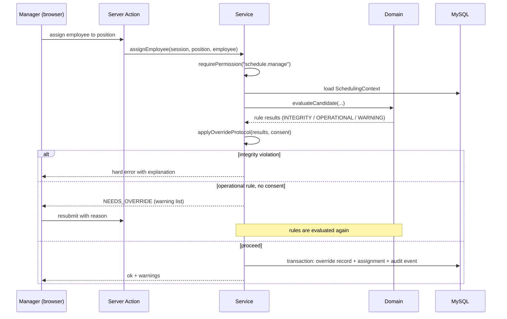

# Architecture

## Style: a modular monolith with three layers

At about a hundred users and a handful of managers working at the same time, there's no
justification for microservices, queues, Redis or GraphQL, so none of them are used. The system
is a single Next.js application backed by a single MySQL database. It is split into ten modules
and three strictly separated layers.

```
┌────────────────────────────────────────────────────────────┐
│ app/            Delivery layer (Next.js)                   │
│   Server Components read by calling services               │
│   Server Actions receive mutations and call services       │
│   Route Handlers only for files, exports, auth endpoints   │
├────────────────────────────────────────────────────────────┤
│ src/server/     Application layer                          │
│   services/     use-cases, transactions, authorization     │
│   audit/        audit trail + override protocol            │
│   db/           Prisma client, transaction helpers         │
├────────────────────────────────────────────────────────────┤
│ src/domain/     Pure domain layer (framework-free TS)      │
│   scheduling/   engine, eligibility, ranking, strategies   │
│   fairness/     THE fairness calculation                   │
│   rules/        rule registry                              │
│   training/     expiry maths, qualification resolution     │
│   rotation/     rest and rotation evaluation               │
│   shared/       role capability matrix, week maths         │
└────────────────────────────────────────────────────────────┘
```

**The load-bearing rule:** `src/domain/` imports nothing from Prisma, Next.js, React or
`src/server/`, and presentation code never touches the database directly. Both rules are ESLint
errors ([excerpt](../excerpts/eslint.layering.mjs)).

## One engine, many entry points

```
Manager action                          Domain (pure)
──────────────                          ─────────────
auto-assign a week / block / range ──▶  runEngine(context)
manual assign (slot picker)        ──▶  evaluateCandidate(context, employee, position)
swap / remove                      ──▶  evaluateCandidate (same function)
change-request approval            ──▶  evaluateCandidate (same function)
planning simulation                ──▶  runEngine(scenarioContext)
reports / dashboards               ──▶  the same eligibility and fairness functions
```

The engine never touches the database. A service loads a `SchedulingContext` (employees,
qualifications, constraints, positions, history and settings) and passes it in. The engine
returns placements, unfilled positions, warnings and a per-position explanation. The service
then decides what to persist, inside a transaction, together with an audit event.

## Request flow for a mutation



`NEEDS_OVERRIDE` is a first-class, typed result, not an exception. The UI renders one standard
dialog for it everywhere.

## Data principles

- **Nothing that history depends on is deleted.** Employees, assignments, qualifications,
  training events and constraints are archived or revoked instead. History-bearing foreign keys
  use `RESTRICT`, not `CASCADE`.
- **Business dates are dates, not timestamps.** The week is the business unit, and dates are
  handled explicitly in the local time zone.
- **Draft and published are different worlds.** Every report states which scope it uses.
  Employees only ever see published data.
- **Settings are data.** Values such as the fairness look-back window, the maximum number of
  consecutive weeks, the warning windows and the ranking strategy are manager-editable settings,
  not constants.

## Authentication

The system uses custom database-backed sessions with Argon2id password hashing and no
third-party auth service. Onboarding goes through an activation flow with a forced password
change, and login attempts are throttled. The authorization model has two roles today and is
built around named permissions (`schedule.manage`, `override.perform`, …), so more roles can be
added without touching call sites.

## Hebrew RTL

`dir="rtl"` is set at the root, and the CSS uses logical properties only. Numbers, dates and IDs
are rendered as left-to-right islands. All user-facing rule messages are defined once, in the
rule registry, and that exact text is saved as a snapshot whenever a rule is overridden.
